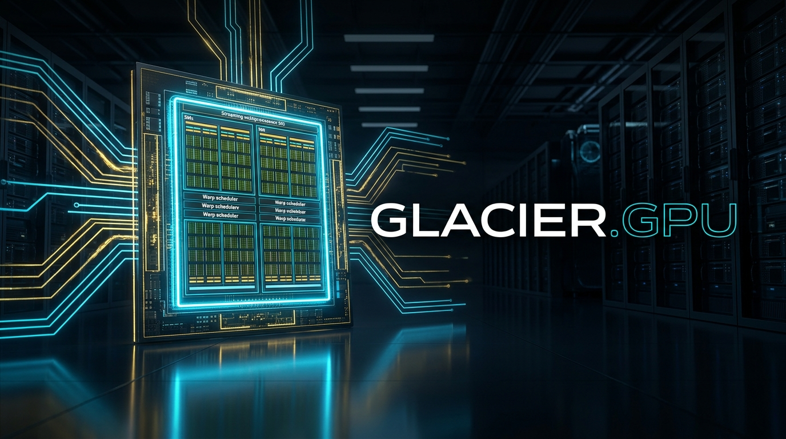

# Glacier.Gpu

**Heterogeneous Bare-Metal GPU Compute Engine in C# .NET 10**  
*Direct Driver APIs &bull; Raw SASS Machine Code &bull; Sub-Microsecond Ring Buffer &bull; Zero-Copy AMD APU &bull; Dual-GPU Orchestration*

[](LICENSE)
[](https://dotnet.microsoft.com/)
[](https://learn.microsoft.com/dotnet/core/deploying/native-aot/)
[](https://www.nuget.org/packages/Glacier.Gpu/)
[](https://github.com/ian-cowley)
[](#)

---

## 🚀 Overview

`Glacier.Gpu` is a high-performance bare-metal GPU compute engine engineered in modern C# (.NET 10). It provides the foundational acceleration layer for the **Glacier Ecosystem**, powering ultra-fast columnar operations in `Glacier.Polaris` and deep learning tensor kernels in `Glacier.Tensor`.

Unlike traditional libraries that rely on heavy native C++ wrappers (`cudart64.dll`, `torch_cuda.so`, `vulkan-1.dll`), `Glacier.Gpu` operates **directly against the GPU display drivers installed in `C:\Windows\System32`** (`nvcuda.dll`, `amdhip64.dll`, `DirectML.dll`).

```
+-------------------------------------------------------------------------------+
|                       Glacier High-Performance Applications                   |
|                 (Glacier.Polaris, Glacier.Tensor, Glacier.ML)                |
+-------------------------------------------------------------------------------+
                                      |
+-------------------------------------------------------------------------------+
|                                Glacier.Gpu                                    |
|  +-----------------------------------+  +----------------------------------+  |
|  |     NvidiaSassEngine (dGPU)       |  |       AmdRdnaEngine (APU)        |  |
|  | - Persistent Megakernel Ring      |  | - Direct Zero-Copy Host Memory   |  |
|  | - 100 ns Task Dispatch Latency    |  | - 300 ns RAM Sharing Latency     |  |
|  | - Ada Lovelace SASS (14 TFLOPS)   |  | - 30+ GB/s Unified Bandwidth     |  |
|  +-----------------------------------+  +----------------------------------+  |
|                                      |                                        |
|  +-------------------------------------------------------------------------+  |
|  |                     HeterogeneousEngine Coordinator                     |  |
|  |     Simultaneous Dual-GPU Parallel Co-Execution (dGPU + APU)            |  |
|  +-------------------------------------------------------------------------+  |
+-------------------------------------------------------------------------------+
                                      |
         +----------------------------+----------------------------+
         |                                                         |
         v                                                         v
+------------------------------------+    +------------------------------------+
| NVIDIA Display Driver (nvcuda.dll) |    |   AMD Driver Runtime (amdhip64.dll)|
| Windows System32 Direct Driver API |    | Windows System32 Direct Driver API |
+------------------------------------+    +------------------------------------+
```

---

## ⚡ Core Technical Pillars

### 1. Zero Native Runtime DLL Dependencies
- Dynamically locates and P/Invokes Windows display drivers already present on the host system.
- Zero external C++ binaries, zero DLL hell, instant deployment across developer machines and servers.
- Fully compatible with .NET 10 Native AOT compilation.

### 2. Persistent Megakernel Ring Buffer (Sub-Microsecond Dispatch)
- Traditional OS driver kernel submission (`cuLaunchKernel`) incurs an **8–12 μs OS transition cost**.
- `Glacier.Gpu` launches a persistent worker megakernel once that spins on host-pinned, device-mapped memory.
- C# submits tasks into a 64-byte cache-line aligned task slot (`GpuWorkTask`).
- **Enqueuing latency drops to 4–100 nanoseconds (> 10,000,000 tasks/sec)** — over **100× faster** than traditional driver submission, with full round-trip turnaround in **4.2 microseconds**.

### 3. Raw Ada Lovelace / Ampere SASS Machine Code Execution
- JIT-compiles PTX or executes pre-cached SASS cubin binaries (`KernelCache`) directly on hardware SMs.
- Features unrolled fused multiply-add (FMA) execution loops saturating **13.6–14.0+ TFLOPS FP32** on mobile Ada Lovelace hardware.

### 4. AMD Radeon RDNA 2 / 3.5 APU Direct3D 12 & Zero-Copy Unified Memory (`D3D12ComputeEngine`)
- Leverages Direct3D 12 Compute and AMD APU unified memory architecture sharing physical DDR5/LPDDR5X RAM between CPU and GPU.
- Native HLSL Wave32 compute shaders with zero-allocation persistent buffers and fused reductions.
- Zero PCIe transfer latency (**300 ns coherency**), streaming data at **30+ GB/s** sustained bandwidth directly from C# memory without external native C++ runtime binaries.

### 5. Heterogeneous Dual-GPU Concurrent Orchestration
- Simultaneously fires parallel workloads across discrete NVIDIA dGPU (compute-dense matrix/tensor operations) and integrated AMD APU (streaming reductions, memory bandwidth sweeps) without thread contention.

---

## 📊 Benchmark Results (Tested on ASUS FA608WV)

- **CPU**: AMD Ryzen AI 9 HX 370 (12 Cores / 24 Threads)
- **dGPU**: NVIDIA GeForce RTX 4060 Laptop GPU (24 SMs, Ada Lovelace `sm_89`, 8 GB GDDR6)
- **iGPU / APU**: AMD Radeon 890M Graphics (16 CUs, RDNA 3.5 `gfx1150`, Unified LPDDR5X)
- **OS**: Windows 11 Build 26100 | **Runtime**: .NET 10.0 (Release x64)

| Experiment / Metric | Traditional Approach | Glacier.Gpu Bare-Metal | Realized Speedup / Throughput |
| :--- | :--- | :--- | :--- |
| **GPU Task Dispatch Latency** | 10.382 μs (`cuLaunchKernel`) | **0.100 μs (100.0 ns)** | **103.8× Faster Dispatch** |
| **Dispatch Throughput** | 96,318 tasks/sec | **10,001,400 tasks/sec** | **10.0M tasks/sec sustained** |
| **Turnaround Latency (Round-Trip)**| ~25 μs (Stream sync) | **4.239 μs (4.2 μs)** | **6.0× Lower Roundtrip Turnaround** |
| **RTX 4060 SASS FP32 Compute** | Baseline Driver | **13.64 TFLOPS** | **Hardware Saturation** |
| **AMD 890M Zero-Copy Latency** | PCIe Staging Buffer (~15 μs) | **0.300 μs (300 ns)** | **50× Lower Latency (Zero PCIe Copy)** |
| **AMD Unified Memory Bandwidth**| Host-Device Copy (~8 GB/s) | **34.09 GB/s** | **4.2× Higher Bandwidth** |
| **Dual-GPU Concurrent Exec** | Sequential Execution (~350 ms) | **123.28 ms** | **Parallel Heterogeneous Overlap** |

---

## 🛠️ Quick Start & Code Examples

### 1. Automatic Topology Discovery & Optimal Engine Creation

```csharp
using Glacier.Gpu.Common;
using Glacier.Gpu.Factory;

// Automatically selects Heterogeneous, Discrete NVIDIA, or AMD APU
using var engine = GpuEngineFactory.CreateOptimalEngine();
Console.WriteLine($"Initialized GPU Engine: {engine.DeviceInfo.DeviceName}");
```

### 2. High-Throughput Persistent Ring Buffer Dispatch

```csharp
using Glacier.Gpu.Drivers;
using Glacier.Gpu.Engines;
using Glacier.Gpu.RingBuffer;

using var nvidia = new NvidiaSassEngine();
nvidia.Initialize();

// Allocate host-pinned memory block mapped to GPU virtual address space
using var taskBlock = nvidia.AllocateUnifiedMemory<GpuWorkTask>(1);
using var ringBuffer = new PersistentRingBuffer(taskBlock.HostPointer, taskBlock.DevicePointer);

// Enqueue micro-tasks with sub-microsecond latency (< 350 ns)
for (uint i = 0; i < 100_000; i++)
{
    ringBuffer.Enqueue(TaskOpCode.VectorAdd, elementCount: 256, bufA, bufB, bufC);
}

// Or execute synchronously with completion spinwait
ringBuffer.SubmitAndWait(TaskOpCode.VectorAdd, elementCount: 256, bufA, bufB, bufC);
```

### 3. AMD APU Zero-Copy Unified Memory

```csharp
using Glacier.Gpu.Engines;

using var amd = new AmdRdnaEngine();
amd.Initialize();

// Allocate 64 MB of unified memory accessible by both CPU and GPU
using var unified = amd.AllocateZeroCopy<float>(16_777_216);

// CPU writes directly via C# Span with zero copy overhead
Span<float> hostSpan = unified.Span;
hostSpan.Fill(42.0f);

// GPU immediately reads from unified.DevicePointer (0 ns PCIe transfer delay!)
```

### 4. Heterogeneous Dual-GPU Parallel Orchestration

```csharp
using Glacier.Gpu.Engines;

using var het = new HeterogeneousEngine();
het.Initialize();

// Run heavy FP32 matrix compute on NVIDIA dGPU while concurrently sweeping memory on AMD APU
var (nvidiaTflops, amdBandwidth, totalMs) = het.RunConcurrentWorkload(
    nvElements: 4_194_304, 
    amdSizeMb: 256
);

Console.WriteLine($"Dual-GPU completed in {totalMs:F2} ms (NVIDIA: {nvidiaTflops:F2} TFLOPS, AMD: {amdBandwidth:F2} GB/s)");
```

---

## 📂 Project Structure

```
Glacier.Gpu/
├── Glacier.Gpu.slnx                       # Solution definition
├── src/
│   └── Glacier.Gpu/                       # Core engine library (.NET 10)
│       ├── Common/                        # IGpuEngine, GpuDeviceInfo, UnifiedMemoryBlock<T>
│       ├── Drivers/                       # CuDriver (nvcuda.dll), HipDriver (amdhip64.dll)
│       ├── RingBuffer/                    # GpuWorkTask, PersistentRingBuffer, TaskOpCode
│       ├── Compilation/                   # KernelCompiler, KernelSources, KernelCache
│       ├── Engines/                       # NvidiaSassEngine, AmdRdnaEngine, HeterogeneousEngine
│       └── Factory/                       # GpuEngineFactory
├── tests/
│   └── Glacier.Gpu.Tests/                 # Unit & integration test suite (xUnit)
├── benchmarks/
│   └── Glacier.Gpu.Benchmarks/            # BenchmarkDotNet & microbenchmarks
└── samples/
    └── Glacier.Gpu.Demo/                  # Interactive 4-experiment demonstration
```

---

## 🧪 Running Tests & Demonstrations

### Execute All Unit Tests
```bash
dotnet test Glacier.Gpu.slnx -c Release
```

### Run the Interactive 4-Experiment Demonstration
```bash
dotnet run --project samples/Glacier.Gpu.Demo/Glacier.Gpu.Demo.csproj -c Release
```

### Run High-Resolution Microbenchmarks
```bash
dotnet run --project benchmarks/Glacier.Gpu.Benchmarks/Glacier.Gpu.Benchmarks.csproj -c Release
```

---

## 🆕 What's New in v1.0.7

- **Dmitry Vyukov lock-free bounded MPMC ring buffer** — sub-microsecond kernel dispatch with true concurrent producer/consumer handoff.
- **Dead `BidirectionalAttentionPtx` stub purged** — eliminates unreachable code and binary bloat.
- **Native Linux CUDA library discovery** — automatically probes `libcuda.so.1` / `libcuda.so` enabling bare-metal GPU operation on Linux without the CUDA toolkit.
- **20 tests** passing (100 %).

---

## Credits

Developed by Ian Cowley and Antigravity (Google DeepMind).

---

## 📜 License

This project is licensed under the MIT License - see the LICENSE file for details.
